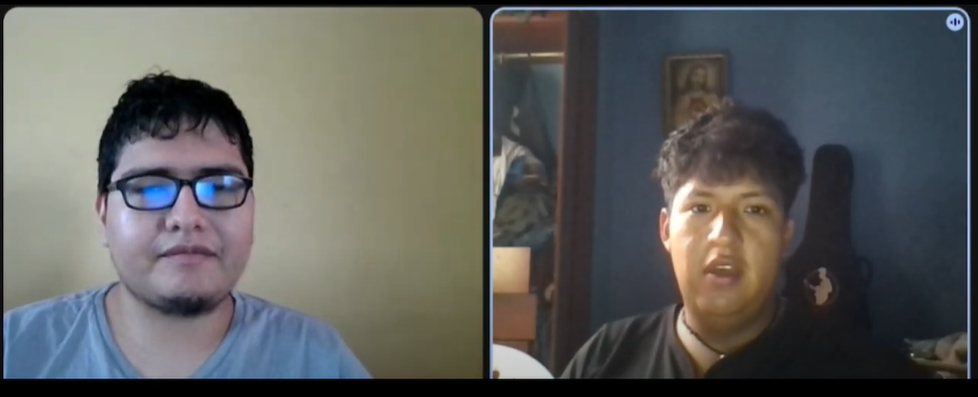
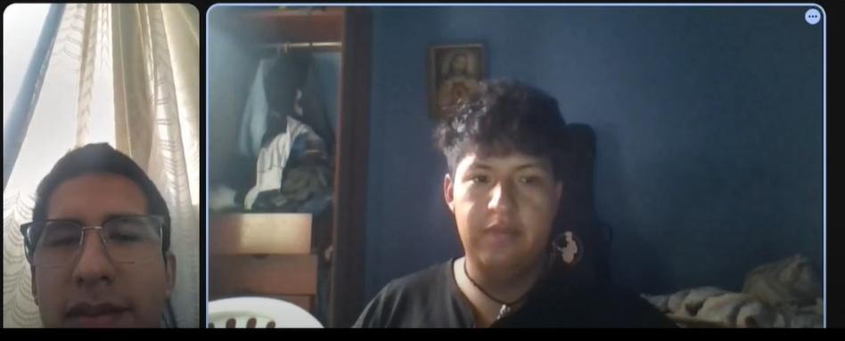
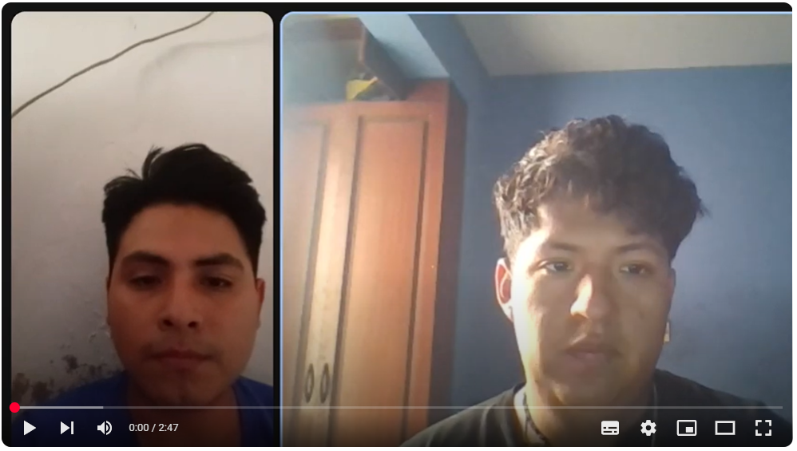

### Capítulo II: Requirements Elicitation & Analysis

###   2.1. Competidores. 

En el ecosistema de soluciones para la gestión de eventos musicales y contratación de artistas, existen diversas plataformas que ofrecen funcionalidades similares a las de TocaAquí. A continuación, se presentan algunos de los competidores más relevantes, junto con un análisis de sus enfoques y una comparación con las fortalezas diferenciales de nuestra propuesta.

  

**Songkick:** Plataforma internacional que permite a los usuarios seguir a sus artistas favoritos, recibir alertas de conciertos en su área y comprar entradas. Aunque facilita el descubrimiento de eventos y la compra de boletos, no gestiona contrataciones directas ni procesos logísticos para los artistas.

🔹 Ventaja de TocaAquí: Nuestra solución no solo conecta, sino que formaliza y ejecuta todo el ciclo de contratación, desde la exploración hasta el pago y la evaluación post-evento.

**GigSalad:**  Marketplace enfocado en conectar talentos artísticos con contratistas para eventos privados, principalmente en EE. UU. Funciona bien en espectáculos particulares, pero carece de enfoque en la escena musical independiente y local.

🔹 Ventaja de TocaAquí: Apuntamos a artistas emergentes que buscan espacios reales de exposición en circuitos culturales, y promovemos la contratación en vivo en espacios públicos y comunitarios.

  

**Indie on the Move:** Plataforma que ayuda a bandas a encontrar lugares donde tocar en Estados Unidos, ofreciendo bases de datos y herramientas para giras. Sin embargo, la gestión sigue siendo manual y sin respaldo de contratos ni pagos seguros.

🔹 Ventaja de TocaAquí: Ofrecemos una experiencia automatizada y segura, con contrato digital, logística integrada y pagos protegidos mediante escrow, además de promoción integrada del evento.

#### 2.1.1. Análisis competitivo. 

| **Competitive Analysis Landscape** |                                                                                      |
|--------------------------------------|--------------------------------------------------------------------------------------|
| **¿Por qué llevar a cabo este análisis?** | Llevar a cabo este análisis nos brindará información crítica que nos permitirá tomar decisiones más informadas y estratégicas para el desarrollo, comercialización y crecimiento de **TocaAquí**. |
------------------------------------------------------------------------------------------------------------------
| **Categoría** | **TocaAquí**  | **Songkick** | **GigSalad** | **Indie on the Move** |
|---------------|--------------|--------------|--------------|------------------------|
| **Perfil - Overview** | Plataforma web que conecta músicos emergentes con bares, promotores y espacios culturales. Ofrece contratación directa, contrato digital, pagos seguros (escrow) y herramientas de promoción. | Plataforma internacional que notifica sobre conciertos de artistas favoritos, con opción de compra de entradas. | Marketplace para contratar artistas y animadores para eventos privados (principalmente en EE. UU.). | Plataforma para que bandas independientes encuentren lugares donde tocar. Ofrece listas de contactos y recursos para planear giras. |
| **Ventaja competitiva** | Conexión directa y segura, contrato digital, logística integrada, sistema de pagos protegidos y promoción del evento. | Gran alcance global y facilidad para descubrir eventos, pero sin contratación directa ni gestión logística. | Facilidad para eventos privados, pero sin enfoque cultural ni contratación formal. | Buen recurso de base de datos, pero sin automatización, sin contratos ni pagos seguros. |
| **Mercado objetivo** | Músicos emergentes, bares, discotecas, centros culturales, promotores de eventos comunitarios. | Fans de la música que buscan descubrir conciertos y comprar entradas. | Organizadores de eventos privados que buscan entretenimiento (bodas, fiestas, etc.). | Bandas que organizan sus propias giras en EE. UU. |
| **Estrategias de marketing** | Redes sociales, colaboraciones con espacios culturales, showcases, recomendaciones por reputación y calificaciones. | Notificaciones personalizadas, integración con plataformas musicales. | Publicidad local y anuncios en redes para eventos privados. | Blog, comunidad en línea y estrategia de posicionamiento SEO. |
| **Productos & Servicios** | Plataforma integral: contratación, pago escrow, firma digital, agenda compartida, validación del rider técnico y promoción del evento. | Seguimiento de artistas, alertas de conciertos, venta de entradas. | Catálogo de artistas, perfiles profesionales, contacto directo. | Listas de contactos de venues, herramientas de planificación de giras. |
| **Precios & Costos** | Comisión por evento concretado. Acceso gratuito con opción premium para funciones adicionales. | Gratuito para usuarios. Ingresos por venta de entradas y acuerdos con promotores. | Comisión por contratación. Costos variables por tipo de artista. | Costos por acceso a base de datos y herramientas. Modelos freemium. |
| **Canales de distribución** | Web, app móvil, WhatsApp Business, integración con plataformas de pago y redes sociales. | Web, app móvil, notificaciones por correo y apps de música. | Web y correo directo con artistas. | Web y app web responsiva. Enfoque en escritorio. |
| **Fortalezas** | Contratación segura, experiencia automatizada, visibilidad para artistas emergentes, soporte integral al evento. | Gran base de usuarios y alianzas con plataformas musicales. | Amplia variedad de artistas para eventos sociales. | Apoyo a bandas independientes, útil para giras DIY. |
| **Debilidades** | Plataforma en crecimiento. Necesita generar masa crítica de usuarios y confianza del mercado. | No gestiona contrataciones ni logística de artistas. | Limitado a eventos privados. Poca presencia cultural o comunitaria. | Gestión manual. Sin soporte legal ni de pagos. Limitado a EE. UU. |
| **Oportunidades** | Expansión a más ciudades, alianzas con promotores, sistema de recompensas por reseñas, integración con plataformas de streaming. | Integración con redes sociales, nuevas funciones de comunidad. | Expansión internacional, integrar funciones logísticas. | Modernización con IA, agregar soporte contractual y pagos. |
| **Amenazas** | Competidores consolidados, reticencia a la digitalización en algunos sectores culturales, dependencia del éxito en eventos piloto. | Saturación del mercado de entradas, cambios en algoritmos de plataformas sociales. | Dependencia del mercado de eventos privados, reputación variable. | Competencia tecnológica, falta de diferenciación a largo plazo. |

####  2.1.2. Estrategias y tácticas frente a competidores.

Para destacar frente a la competencia en el sector musical y de eventos, TocaAquí debe implementar estrategias y tácticas diferenciadoras que refuercen su propuesta de valor y logren captar tanto a músicos como a promotores y locales. Estas son algunas de las principales estrategias y tácticas planteadas:

###### 1.**Desarrollar una Propuesta de Valor Única**
- **Estrategia:** Resaltar los beneficios clave de TocaAquí como plataforma integral para la contratación y promoción de talento musical emergente.  
- **Táctica:** Enfatizar características como contratos digitales, pagos seguros (escrow), validación de rider técnico y agenda compartida para destacar la profesionalización del proceso.

###### 2. **Enfoque en la Experiencia del Usuario**
- **Estrategia:** Optimizar la experiencia tanto para músicos como para promotores mediante una interfaz clara, intuitiva y funcional.  
- **Táctica:** Mejorar continuamente la usabilidad de la plataforma, con flujos ágiles para programación de eventos, seguimiento de pagos y validación de logística técnica.

###### 3. **Ampliar la Base de Usuarios**
- **Estrategia:** Aumentar la comunidad de usuarios para consolidar la red y generar más oportunidades de conexión musical.  
- **Táctica:** Implementar campañas de referidos para músicos y promotores, junto con descuentos por primera contratación y beneficios por uso frecuente.

###### 4. **Marketing Digital Segmentado**
- **Estrategia:** Enfocar la comunicación digital hacia artistas independientes, bookers y dueños de locales culturales.  
- **Táctica:** Usar campañas dirigidas en redes sociales, con contenidos creativos (videos de artistas, experiencias de contratación) y pauta en nichos como festivales locales, ferias musicales y foros de emprendimiento artístico.

###### 5. **Alianzas Estratégicas**
- **Estrategia:** Colaborar con instituciones culturales, asociaciones de músicos y marcas relacionadas con la música en vivo para aumentar la visibilidad y credibilidad.  
- **Táctica:** Generar convenios con bares, discotecas, escuelas de música y empresas de sonido para ofrecer beneficios cruzados y asegurar presencia constante en la escena.

###   2.2. Entrevistas. 

####   2.2.1 Diseño de entrevistas. 

#### Segmento Objetivo Administradores de locales
#### Preguntas Objetivas:

**Características Demográficas:**

- ¿Cuál es tu género?
- ¿Cuántos años tienes?
- ¿En qué ciudad y distrito está ubicado tu local?
- ¿Cuál es el aforo y tipo de espacio que administras (bar, discoteca, centro cultural, etc.)?

**Ocupación y Responsabilidades:**

- ¿Cuál es tu cargo dentro del establecimiento?
- ¿Qué funciones desempeñas específicamente en la organización y gestión de eventos?
- ¿Con qué frecuencia alquilas tu espacio para presentaciones musicales?
- ¿Cómo gestionas actualmente la programación de artistas y bandas?

**Uso de Tecnología:**

- ¿Qué dispositivos usas para gestionar tu local (PC, laptop, tablet, celular)?
- ¿Qué herramientas digitales o sistemas usas para reservas, programación o promoción?
- ¿Qué canales usas para comunicarte con músicos o productores?

#### Preguntas Subjetivas:

**Personalidad y Habilidades:**

- ¿Qué habilidades personales consideras claves para manejar eventos y relaciones con artistas?

**Objetivos y Frustraciones:**

- ¿Qué objetivos tienes al permitir que bandas se presenten en tu espacio?
- ¿Qué problemas o frustraciones enfrentas al gestionar reservas, pagos o promociones?
- ¿Qué procesos te gustaría automatizar?

**Preferencias y Canales Digitales:**
- ¿¿Qué funcionalidades valorarías en una plataforma que centralice reservas, pagos y promoción de eventos?
-¿Cómo prefieres recibir notificaciones sobre postulaciones o confirmaciones de artistas?

**Visión del Futuro:**

- ¿Cómo te gustaría que evolucionara el proceso de reserva y programación musical?
- ¿Qué mejoras digitales facilitarían tu trabajo como administrador de espacios?

#### Segmento Objetivo Artistas:
#### Preguntas Objetivas:

**Características Demográficas:**

- ¿Cuál es tu género?
- ¿Cuántos años tienes?
- ¿Cuál es tu rol musical (solista, vocalista, guitarrista, DJ, etc.)?
- ¿Tocas solo o formas parte de una banda?

**Ocupación y Responsabilidades:**

- ¿Desde hace cuánto tiempo estás activo/a como músico?
- ¿Cuántas presentaciones en vivo realizas en promedio al mes?
- ¿Qué tipo de escenarios frecuentas (bares, festivales, discotecas)?

**Uso de Tecnología:**

- ¿Qué dispositivos usas para organizar tus presentaciones (PC, celular, tablet)?
- ¿Qué redes o plataformas usas para gestionar tus bookings o mostrar tu trabajo (Instagram, SoundCloud, etc.)?
- ¿Usas algún sistema para generar contratos o manejar pagos?

#### Preguntas Subjetivas:

**Personalidad y Habilidades:**

- ¿Cómo defines tu estilo musical y tu enfoque en vivo?
- ¿Qué habilidades consideras esenciales para posicionarte como artista en la escena local?

**Objetivos y Frustraciones:**

- ¿Qué metas tienes en relación con tus presentaciones en vivo?
- ¿Qué dificultades encuentras al buscar espacios para tocar?
- ¿Qué parte del proceso (contacto, pagos, contratos, logística) te resulta más difícil o engorrosa?

**Preferencias y Canales Digitales:**

- ¿Qué funcionalidades valoras en una plataforma para músicos (contratos automáticos, pagos seguros, agenda, etc.)?
- ¿Por qué motivos dejarías de usar una plataforma si no cumpliera con tus expectativas?

**Visión del Futuro:**
- ¿Cómo te gustaría que evolucionaran los procesos de contratación y visibilidad para músicos independientes?
- ¿Qué esperas de una plataforma digital que prometa conectarte con promotores y espacios?

####   2.2.2 Registro de entrevistas. 

#### Segmento Administrador de locales

Entrevistado #1

| Campo                        | Información                                                                                                                           |
|-----------------------------|---------------------------------------------------------------------------------------------------------------------------------------|
| **Nombre del entrevistado** | Luis Gamarra                                                                                                                          |
| **Edad**                    | 28 años                                                                                                                               |
| **Distrito**                | Barranco                                                                                                                             |
| **Screenshot de la entrevista**|                                                                                  |
| **Link de la entrevista**   |                                                                                                                         |
| **Tiempo de inicio y duración** |                                                                                    |
| **Resumen**                 | Luis es administrador de “El Refugio”, un bar cultural en Barranco con capacidad para 120 personas. Tiene 35 años, trabaja con laptop y celular, y usa WhatsApp, Instagram y llamadas para coordinar con artistas. Nos cuenta que su rol incluye seleccionar bandas, coordinar sonido, cuadrar horarios y verificar pagos, pero que gran parte del proceso es desordenado. A veces los músicos no mandan información completa, llegan tarde o no cumplen lo prometido. Le frustra no tener un sistema centralizado que le permita ver el calendario, firmar contratos digitalmente, recibir notificaciones automáticas o revisar propuestas ya filtradas según estilo musical. Le interesa profesionalizar la gestión de eventos, automatizar los pagos y dejar de depender de chats dispersos. Dice que si existiera una plataforma que agrupe todo (contratación, pagos, agenda y promoción) le facilitaría muchísimo el trabajo y le permitiría manejar más eventos sin tanto estrés. |
----
Entrevistado #2

| Campo                        | Información                                                                                                                           |
|-----------------------------|---------------------------------------------------------------------------------------------------------------------------------------|
| **Nombre del entrevistado** | Daniel Rivas                                                                                                                        |
| **Edad**                    | 25  años                                                                                                                               |
| **Distrito**                | Miraflores                                                                                                                             |
| **Screenshot de la entrevista**|                                                                                  |
| **Link de la entrevista**   |                                                                                                                         |
| **Tiempo de inicio y duración** |                                                                                    |
| **Resumen**                 | Daniel trabaja como encargado de booking en “Volta”, un club nocturno de música electrónica y fusión que organiza 2 o 3 eventos semanales. Tiene 42 años, lleva años en el rubro y nos comenta que si bien tiene experiencia, los procesos siguen siendo bastante manuales. Usa Excel para llevar la agenda de bandas, WhatsApp para coordinar y Word para generar contratos. Nos dijo que eso le funciona, pero ya se siente anticuado y lento. A veces ha tenido problemas con bandas que cambian condiciones después de confirmar o con pagos mal coordinados. Le interesaría una herramienta donde todo quede registrado y se puedan revisar las condiciones sin malentendidos. También quiere poder visualizar la programación del mes por tipo de música, y si fuera posible, contar con un historial de artistas que hayan trabajado con otros locales. Según él, profesionalizar esto es clave para no perder tiempo ni dinero en errores logísticos. |
----
Entrevistado #3

| Campo                        | Información                                                                                                                           |
|-----------------------------|---------------------------------------------------------------------------------------------------------------------------------------|
| **Nombre del entrevistado** | Carmen Navarro                                                                                                                          |
| **Edad**                    | 29  años                                                                                                                               |
| **Distrito**                | Barranco                                                                                                                             |
| **Screenshot de la entrevista**|                                                                                  |
| **Link de la entrevista**   |                                                                                                                         |
| **Tiempo de inicio y duración** |                                                                                    |
| **Resumen**                 | Carmen es coordinadora de eventos en “La Sazón del Ruido”, un café cultural con espacio para 80 personas. Tiene 29 años y usa principalmente su celular y laptop para programar la cartelera musical. Nos contó que trabaja con artistas locales y viajeros, y que recibe muchas propuestas por DM de Instagram, lo que le complica hacer seguimiento formal. Le frustra tener que redactar contratos desde cero cada vez y no tener una forma rápida de filtrar por estilo musical o fecha disponible. Mencionó que suele perder tiempo ajustando horarios o buscando reemplazos de último minuto. Para ella, una plataforma donde pueda recibir postulaciones ordenadas, ver el historial de cada banda, programar eventos en una agenda visual y automatizar los pagos sería ideal. También le gustaría que los artistas pudieran subir directamente su rider técnico, así no tiene que estar pidiendo eso por correo o mensajes sueltos. |

 
#### Segmento Artistas

Entrevistado #1

| Campo                        | Información                                                                                                                           |
|------------------------------|---------------------------------------------------------------------------------------------------------------------------------------|
| **Nombre del entrevistado**  | Diego Salazar                                                                                                                         |
| **Edad**                     | 22 años                                                                                                                               |
| **Distrito**                 | Miraflores                                                                                                                            |
| **Screenshot de la entrevista** |                                  |
| **Link de la entrevista**    |           [Ver entrevista en Microsoft Stream](https://upcedupe-my.sharepoint.com/:v:/g/personal/u201923571_upc_edu_pe/EWucF2Wx8kZLknoRpxJqUJ0BUdDk-iIFTWJufP1u4waOWQ?e=D0scVZ&nav=eyJyZWZlcnJhbEluZm8iOnsicmVmZXJyYWxBcHAiOiJTdHJlYW1XZWJBcHAiLCJyZWZlcnJhbFZpZXciOiJTaGFyZURpYWxvZy1MaW5rIiwicmVmZXJyYWxBcHBQbGF0Zm9ybSI6IldlYiIsInJlZmVycmFsTW9kZSI6InZpZXcifX0%3D)                                                                                                          |
| **Tiempo de inicio y duración** |                  0:00 - 2:35                                                                                                |
| **Resumen**                  | Diego es guitarrista y vocalista en una banda de rock alternativo con base en Miraflores. Tiene 6 años de experiencia en la escena independiente y suele tocar 2-3 veces por mes, especialmente en bares y pequeños festivales. Coordina sus shows usando celular, laptop e Instagram, pero siente que todo el proceso es poco formal y genera mucha incertidumbre, especialmente en pagos y cumplimiento de horarios. Considera que la gestión es muy desordenada y dependiente de la buena voluntad de cada promotor. Le gustaría que una plataforma le permita centralizar fechas, asegurar pagos con escrow y gestionar contratos digitales, para enfocarse más en la música y menos en la negociación informal. |

----
Entrevistado #2

| Campo                        | Información                                                                                                                           |
|------------------------------|---------------------------------------------------------------------------------------------------------------------------------------|
| **Nombre del entrevistado**  | Juan Gutiérrez                                                                                                              |
| **Edad**                     | 24 años                                                                                                                               |
| **Distrito**                 | Comas                                                                                                                                 |
| **Screenshot de la entrevista** |                                                                                                                     |
| **Link de la entrevista**    |              [Ver entrevista en Microsoft Stream](https://upcedupe-my.sharepoint.com/:v:/g/personal/u201923571_upc_edu_pe/EWucF2Wx8kZLknoRpxJqUJ0BUdDk-iIFTWJufP1u4waOWQ?e=D0scVZ&nav=eyJyZWZlcnJhbEluZm8iOnsicmVmZXJyYWxBcHAiOiJTdHJlYW1XZWJBcHAiLCJyZWZlcnJhbFZpZXciOiJTaGFyZURpYWxvZy1MaW5rIiwicmVmZXJyYWxBcHBQbGF0Zm9ybSI6IldlYiIsInJlZmVycmFsTW9kZSI6InZpZXcifX0%3D)                                                                                                                                           |
| **Tiempo de inicio y duración** |             2:35-5:02                                                                                                     |
| **Resumen**                  | Juan es vocalista de “Los Soneros del Amor”, una banda de cumbia que trabaja activamente en eventos sociales, discotecas y matrimonios. Vive en Comas y realiza entre 6 a 8 presentaciones mensuales. Su principal medio de coordinación es el celular, usando sobre todo WhatsApp y llamadas para concretar fechas. Menciona que los contratos casi nunca se formalizan y los pagos suelen ser inciertos hasta el día del evento, generando estrés y cancelaciones imprevistas. Le interesa especialmente una solución digital que garantice seguridad en pagos y centralice todas las gestiones, reduciendo riesgos y mejorando la confianza con los espacios. |

----
Entrevistado #3

| Campo                        | Información                                                                                                                           |
|------------------------------|---------------------------------------------------------------------------------------------------------------------------------------|
| **Nombre del entrevistado**  | Luis  Paredes                                                                                                                  |
| **Edad**                     | 30 años                                                                                                                               |
| **Distrito**                 | Pueblo Libre                                                                                                                          |
| **Screenshot de la entrevista** |                                                                                                                      |
| **Link de la entrevista**    |     [Ver entrevista en Microsoft Stream](https://upcedupe-my.sharepoint.com/:v:/g/personal/u201923571_upc_edu_pe/EWucF2Wx8kZLknoRpxJqUJ0BUdDk-iIFTWJufP1u4waOWQ?e=D0scVZ&nav=eyJyZWZlcnJhbEluZm8iOnsicmVmZXJyYWxBcHAiOiJTdHJlYW1XZWJBcHAiLCJyZWZlcnJhbFZpZXciOiJTaGFyZURpYWxvZy1MaW5rIiwicmVmZXJyYWxBcHBQbGF0Zm9ybSI6IldlYiIsInJlZmVycmFsTW9kZSI6InZpZXcifX0%3D)                                                                                                                                                                 |
| **Tiempo de inicio y duración** |                5:02-7:50                                                                                                  |
| **Resumen**                  | Luis es músico criollo con más de 18 años de trayectoria, vive en Pueblo Libre y trabaja como solista y en dúos en peñas, restaurantes y eventos culturales. Realiza entre 4 a 5 presentaciones mensuales. Coordina sus fechas por WhatsApp o llamadas, sin usar contratos formales, lo que muchas veces ha provocado malentendidos en pagos y condiciones. Considera que la informalidad es el principal problema de la escena y que una plataforma como TocaAquí podría facilitar mucho su trabajo si le ofrece contratos digitales, pagos garantizados y un espacio donde promover su agenda de shows. |

####   2.2.3 Análisis de entrevistas. 

#### Segmento Objetivo #1: Administradores de Locales

A partir de las entrevistas realizadas a tres responsables de espacios culturales y de entretenimiento (Luis Gamarra, Carmen Navarro y Daniel Rivas) se identificaron patrones comunes, necesidades claras y desafíos compartidos en torno a la gestión de eventos musicales y contratación de artistas en el ámbito independiente.

---

#### Uso de Tecnología y Herramientas de Gestión

Todos los entrevistados manifestaron usar tecnología básica para la gestión de sus espacios. Los dispositivos más frecuentes son el **celular y la laptop**, y las herramientas más empleadas son **WhatsApp, Instagram, llamadas telefónicas**, y **procesadores de texto como Word o Excel**.

Sin embargo, a pesar del uso cotidiano de herramientas digitales, la gestión aún es **altamente manual y descentralizada**. Se evidenció que:

- **100%** de los entrevistados utiliza WhatsApp como canal principal de coordinación con artistas.
- **100%** emplea hojas de cálculo (Excel o similar) para organizar agendas o contratos.
- **67%** aún redacta contratos de forma manual en Word.
- **67%** indicó que reciben propuestas artísticas por redes sociales, principalmente **Instagram**, lo que dificulta su seguimiento.
- **0%** usa actualmente una plataforma integral de contratación musical o programación de eventos.

---
#### Dispositivos Utilizados

Con base en las entrevistas, se identificó que el 100% de los administradores utilizan tanto laptop como celular para llevar a cabo sus tareas, lo que refleja una necesidad de portabilidad y flexibilidad en su gestión diaria. Ninguno mencionó utilizar tabletas ni depender exclusivamente de un solo tipo de dispositivo.

| Canal                   | Uso (%) |
|------------------------|---------|
| Laptop                 | 100%    |
| Celular                | 100%    |

---

#### Canales de Comunicación más Usados

| Canal                   | Uso (%) |
|------------------------|---------|
| WhatsApp               | 100%    |
| Instagram (DMs)        | 67%     |
| Llamadas telefónicas   | 67%     |
| Correo electrónico     | 33%     |

La informalidad en estos canales genera pérdida de información y dificulta el seguimiento de acuerdos o condiciones pactadas.

---

#### Expectativas hacia Soluciones Tecnológicas

Los tres entrevistados coinciden en la necesidad de **profesionalizar y automatizar** sus procesos. Los aspectos más valorados en una solución digital serían:

- **Agenda visual compartida** para tener clara la programación de eventos.
- **Contratos digitales automatizados**, con cláusulas estándar y firma integrada.
- **Pagos seguros y automatizados**, que eviten retrasos y malentendidos financieros.
- **Postulación filtrada por estilo musical**, evitando el desorden de revisar mensajes no relevantes.
- **Historial de bandas y evaluación post-evento**, para generar confianza y decisiones basadas en reputación.
- **Subida directa del rider técnico por parte del músico**, como una mejora logística clave.

---

#### Principales Desafíos Identificados

| Desafío                                                    | Mención (%) |
|-------------------------------------------------------------|-------------|
| Informalidad en la contratación y comunicación              | 100%        |
| Falta de una agenda visual centralizada                     | 100%        |
| Redacción manual y repetitiva de contratos                  | 67%         |
| Dificultad para recibir y filtrar propuestas artísticas     | 67%         |
| Problemas logísticos derivados de cambios de último minuto  | 67%         |

---

#### Conclusiones del Segmento

Los administradores entrevistados revelan una **alta carga operativa** asociada a la informalidad en la gestión musical. Existe una necesidad latente de una **plataforma digital integral como TocaAquí**, que centralice la contratación, pagos, agenda, comunicación y promoción. La solución tendría una **alta adopción** si se adapta a sus flujos actuales, reduce la fricción operativa y eleva el estándar profesional tanto para espacios como para artistas. Además, se percibe un interés genuino en dejar atrás los métodos dispersos y manuales por una gestión moderna, eficiente y confiable.

---

### 2.2.3. Análisis de entrevistas

### Segmento Objetivo #2: Artistas y Músicos Independientes

A partir de las entrevistas realizadas a tres músicos con distintos perfiles y géneros —Diego Salazar (rock alternativo), Juan Gutiérrez (cumbia) y Luis Paredes (criollo)— se identifican patrones comunes que reflejan claramente los problemas de informalidad, incertidumbre y desorganización en la escena musical independiente. Todos ellos realizan múltiples presentaciones al mes, pero coinciden en que los procesos actuales de contratación son poco confiables y desordenados.

---

#### Herramientas y dispositivos más utilizados

Los artistas entrevistados hacen uso intensivo de herramientas digitales básicas para coordinar sus presentaciones. Todos mencionaron el uso del celular como su herramienta principal, junto a canales como WhatsApp, llamadas e incluso Instagram.

| Herramienta / Dispositivo   | Uso (%) |
|-----------------------------|---------|
| Celular                     | 100%    |
| WhatsApp                    | 100%    |
| Llamadas telefónicas        | 100%    |
| Laptop                      | 67%     |
| Instagram                   | 33%     |

La gestión digital existe, pero es desarticulada. No utilizan plataformas centralizadas ni herramientas profesionales para contratación, pagos o promoción de sus eventos.

---

#### Canales de Coordinación

Los tres entrevistados afirmaron que la coordinación con los promotores se realiza casi exclusivamente por WhatsApp o llamadas. Uno de ellos también recibe propuestas por DM de Instagram, aunque indicó que eso complica el seguimiento.

Esto evidencia una alta dependencia de canales informales, lo que abre una gran oportunidad para una herramienta que centralice y profesionalice la gestión.

---

#### Desafíos Actuales Identificados

| Desafío                                                        | Mención (%) |
|----------------------------------------------------------------|-------------|
| Informalidad en pagos                                           | 100%        |
| Falta de contratos escritos o claros                           | 100%        |
| Cambios de último minuto en condiciones o fechas               | 67%         |
| Incertidumbre hasta el día del evento                          | 100%        |
| Mala comunicación con algunos locales                          | 67%         |

---

#### Expectativas hacia soluciones tecnológicas

Todos los artistas expresaron un fuerte interés por contar con una solución que:

- Les permita centralizar fechas y postulaciones.
- Ofrezca contratos digitales automáticos.
- Garantice pagos seguros, idealmente bajo un sistema tipo escrow.
- Permita promocionar sus shows de forma profesional.
- Reduzca la necesidad de múltiples conversaciones y negociaciones por separado.

---

#### Conclusión del análisis

Los artistas entrevistados tienen un perfil activo y profesional, pero operan dentro de un sistema informal y poco estructurado. Existe una clara necesidad de una plataforma como TocaAquí, que automatice y profesionalice todo el proceso de contratación musical: desde la postulación hasta el pago final.

La falta de contratos y de seguridad en los pagos fue el punto más crítico mencionado en las tres entrevistas. Además, mostraron alta disposición a adoptar nuevas tecnologías si estas reducen el estrés operativo y les permiten enfocarse en lo que realmente importa: su música.

###   2.3. Needfinding. 

####   2.3.1 User Personas. 

Para entender mejor a nuestros usuarios clave, hemos creado dos perfiles de User Persona que representan de forma ficticia a nuestros segmentos principales: artistas independientes y administradores de locales. Estos perfiles nos permiten identificar sus motivaciones, frustraciones, hábitos y expectativas, facilitando el diseño de una solución más alineada con sus necesidades reales y mejorando así su experiencia con la plataforma.

#### Segmento Objetivo Administradores de locales

#### Segmento Objetivo Artista independiente

####   2.3.2 User Task Matrix.

#### - Artista Independiente:

| **Tareas** | **Frecuencia** | **Importancia** |
|------------|----------------|-----------------|
| Buscar y postularse a nuevos escenarios y eventos | Always | High |
| Firmar contratos formales para presentaciones | Sometimes | High |
| Coordinar fechas, pagos y ensayos desde una sola plataforma | Always | High |
| Gestionar su agenda y compromisos artísticos | Always | High |
| Promocionar sus eventos en redes sociales | Sometimes | Medium |
| Crear y actualizar su perfil artístico profesional | Always | High |
| Evaluar presentaciones y recibir feedback para mejorar | Sometimes | Medium |
| Asegurar pagos mediante mecanismos confiables | Sometimes | High |
| Crear contenido para mantener su visibilidad en redes | Sometimes | Medium |

---

#### - Administrador de Local:

| **Tareas** | **Frecuencia** | **Importancia** |
|------------|----------------|-----------------|
| Publicar disponibilidad de fechas y espacios para eventos | Always | High |
| Recibir y filtrar propuestas de artistas | Always | High |
| Coordinar logística y ensayos de manera organizada | Sometimes | High |
| Formalizar contratos y pagos a través de una plataforma | Sometimes | High |
| Gestionar inventario técnico (sonido, luces, etc.) | Sometimes | Medium |
| Evaluar artistas después de los eventos | Sometimes | Medium |
| Promocionar eventos en redes sociales | Sometimes | Medium |
| Controlar asistencia y recolectar feedback del público | Sometimes | Medium |
| Automatizar tareas operativas para ahorrar tiempo | Always | High |

####   2.3.3 User Journey Mapping.

En esta sección, analizaremos el recorrido del usuario al utilizar nuestra plataforma TocaAqui

**Segmento 1: Músicos Independientes**  
  

**Segmento 2: Promotores**  
     

####   2.3.4 Empathy Mapping.

En esta sección se presenta el Empathy Mapping, una herramienta para crear un perfil detallado de los user personas y desarrollar una comprensión profunda de su perspectiva y experiencia. Para cada user persona, se incluyen cinco elementos clave: lo que el usuario ve, lo que el usuario escucha, lo que el usuario dice, lo que el usuario hace y lo que el usuario siente.

**Segmento 1: Músicos Independientes**  
</a>  

**Segmento 2: Promotores**  
</a>   

####   2.3.5 As-is Scenario Mapping.

**As-Is Scenario Mapping Músicos Independientes**  

**Preparación de la actividad**  
Preparamos el cuadro y lo dividimos en fases: Steps, Doing, Thinking y Feeling

</a>    

**Brainstorming**  
Se obtuvo el siguiente resultado en el proceso de la lluvia de ideas:

</a>    

**As-Is Scenario Mapping Músicos Independientes**  
Finalmente, luego de identificar las fases y organizar ideas, se obtuvo el siguiente resultado:

</a>    

**As-Is Scenario Mapping Promotores**  

**Preparación de la actividad**  
Preparamos el cuadro y lo dividimos en fases: Steps, Doing, Thinking y Feeling

</a>    

**Brainstorming**  
Se obtuvo el siguiente resultado en el proceso de la lluvia de ideas:

</a>    

**As-Is Scenario Mapping Músicos Independientes**  
Finalmente, luego de identificar las fases y organizar ideas, se obtuvo el siguiente resultado:

</a>  

###   2.4 Ubiquitous Language.

A continuación se presenta un glosario con los términos centrales del dominio de la plataforma **TocaAquí**. Este vocabulario compartido garantiza que todas las partes involucradas (usuarios, desarrolladores, stakeholders) utilicen un lenguaje consistente y sin ambigüedades.

| **Término (Inglés)**       | **Término (Español)**          | **Definición clara y compartida** |
|----------------------------|-------------------------------|-----------------------------------|
| **Artist**                 | Artista                        | Músico independiente o banda registrada en la plataforma que busca espacios para tocar en vivo. |
| **Venue**                  | Local / Espacio                | Bar, discoteca, café cultural u otro lugar físico que organiza eventos musicales y contrata artistas. |
| **Booking**                | Contratación / Reserva         | Proceso de solicitud, selección y confirmación de un artista por parte de un local para una fecha específica. |
| **Application**            | Postulación                    | Acción mediante la cual un artista se propone para tocar en una fecha publicada por un local. |
| **Digital Contract**       | Contrato digital               | Acuerdo legal generado automáticamente por la plataforma y firmado por ambas partes (artista y local). |
| **Escrow Payment**         | Pago con garantía (escrow)     | Sistema de pago seguro en el que el dinero se libera solo después de realizarse el evento según lo acordado. |
| **Technical Rider**        | Rider técnico                  | Documento que contiene los requerimientos técnicos del artista para su presentación (sonido, luces, etc.). |
| **Soundcheck**             | Prueba de sonido               | Ensayo técnico previo al evento para ajustar equipos de audio e instrumentos en el escenario. |
| **Shared Agenda**          | Agenda compartida              | Herramienta visual donde locales y artistas pueden ver fechas reservadas, confirmadas y disponibles. |
| **Event Promotion**        | Promoción del evento           | Acciones realizadas para visibilizar un show programado (publicación en redes, cartelera digital, etc.). |
| **Post-event Evaluation**  | Evaluación post-evento         | Sistema de calificación y feedback mutuo entre artistas y locales una vez realizado el evento. |
| **Filtered Application**   | Postulación filtrada           | Mecanismo mediante el cual los locales reciben propuestas artísticas según criterios definidos (género, reputación, etc.). |
| **Logistics Manager**      | Gestor de logística            | Módulo de la plataforma que centraliza todos los detalles técnicos, fechas, contratos y coordinación del evento. |
