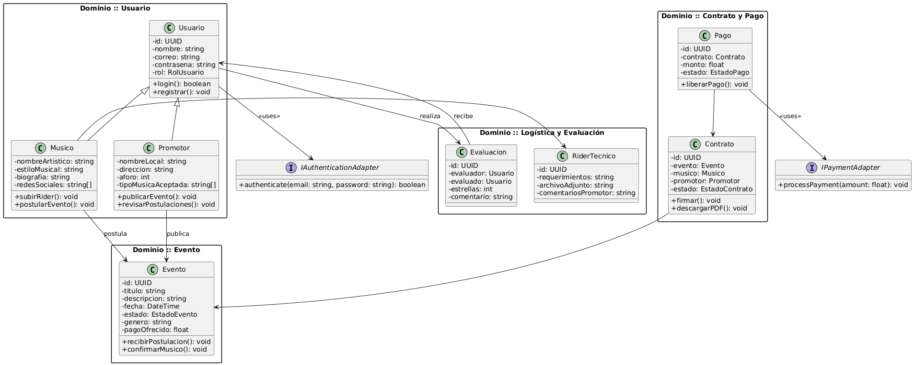
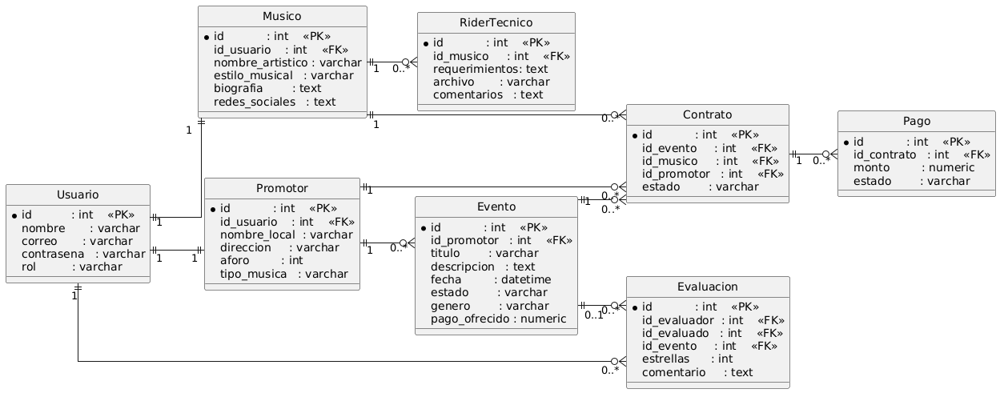

### Capítulo IV: Product Design 

El **product design** es el proceso de crear un producto funcional y atractivo, considerando la experiencia del usuario, la estética y la usabilidad. Busca resolver problemas de manera efectiva, asegurando que el producto sea fácil de usar y satisfactorio para el cliente.

### 4.1. Style Guidelines.

Un **Style Guideline** es un conjunto de normas y directrices que establecen cómo deben presentarse de manera consistente los elementos visuales y textuales en un proyecto. Esto incluye tipografía, colores, espaciado, tono de voz y otros detalles que garantizan una comunicación coherente y uniforme a lo largo del proyecto.

### 4.1.1. General Style Guidelines

Para la creación del logo de nuestro producto **TocaAquí**, se ha optado por un diseño moderno y atractivo que refleje la misión y visión de la plataforma. El logotipo está compuesto por una tipografía estilizada y sencilla, acompañada de un ícono que simboliza la conexión entre músicos y promotores. La tipografía de "TocaAquí" es clara, con un toque creativo para transmitir dinamismo y accesibilidad. Los colores seleccionados para la paleta son cálidos y vibrantes, creando una sensación de energía y creatividad, lo cual refleja el mundo de la música y el entretenimiento. Se emplean tonos naranjas y dorados para transmitir energía y creatividad, mientras que los tonos de gris y blanco aportan un contraste elegante y moderno

**Typography**

Para la tipografía de TocaAquí, se ha seleccionado una fuente moderna y legible que se adapta a la estética vibrante y profesional del proyecto. La tipografía principal es Montserrat, una fuente sans-serif que proporciona una apariencia limpia, contemporánea y fácil de leer en entornos digitales. Esta fuente se utiliza principalmente en los textos del cuerpo y en elementos informativos.

Para los encabezados y títulos, se ha optado por la fuente Roboto, que aporta un estilo más audaz y dinámico, ideal para destacar secciones importantes y captar rápidamente la atención del usuario.

A continuación, se presentan las tipografías seleccionadas para TocaAquí:

**Colors**

La paleta de colores de **TocaAquí** está diseñada para transmitir **creatividad, energía y confianza**, alineándose con la identidad vibrante del proyecto. Se han seleccionado tonos que evocan la **pasión por la música** y la **conexión entre artistas y espacios culturales**, asegurando una experiencia visual atractiva y coherente.

**Spacing**

El espaciado en TocaAquí ha sido cuidadosamente diseñado para asegurar una interfaz intuitiva y fácil de usar. El objetivo es proporcionar una experiencia de usuario fluida, con suficiente espacio entre los elementos para mejorar la legibilidad y facilitar la interacción. Un espaciado uniforme en todo el diseño mantiene una estructura ordenada y clara, sin sobrecargar visualmente a los usuarios.

### 4.1.2. Web Style Guidelines

Para TocaAquí, estamos desarrollando una plataforma web responsiva que se adapta a distintos dispositivos, como laptops, tablets y smartphones. Esta decisión responde a la necesidad de brindar una experiencia accesible y fluida para músicos, promotores y usuarios desde cualquier lugar.

Hemos decidido implementar el patrón de diseño en forma de Z, un enfoque visual que facilita el recorrido del ojo humano a través de la interfaz. Este patrón guía al usuario hacia los elementos más importantes de la página, mejorando la retención de información y la interacción con el contenido.

Siguiendo este patrón, ubicamos el logotipo de TocaAquí en la esquina superior izquierda, asegurando visibilidad inmediata de la marca. En la esquina superior derecha, colocamos la barra de navegación junto a un botón de acción destacado, como “Publicar Evento” o “Unirse como Músico”, fomentando así la participación activa de los usuarios.

## 4.2. Information Architecture.

La arquitectura de información es esencial para organizar y estructurar el contenido de manera que sea fácilmente accesible y comprensible para los usuarios de la plataforma TocaAquí. En esta sección, se presentan los sistemas de organización, etiquetado, etiquetas SEO y metaetiquetas, sistemas de búsqueda y navegación que guiarán la experiencia del usuario. Estas directrices están diseñadas para mejorar la usabilidad, promover la exploración fluida del contenido y garantizar que cada usuario —ya sea músico o promotor— encuentre rápidamente lo que necesita.

### 4.2.1. Organization Systems.

Los sistemas de organización que se implementarán en **TocaAquí** responden a distintos contextos de uso y tipos de contenido que ofrece la plataforma. A continuación, se describen los tipos de organización aplicados y los esquemas de categorización adoptados:

**Organización Jerárquica (Visual Hierarchy)**

Se utilizará para estructurar la **navegación principal** y secciones clave como:

- **Inicio**
- **Explorar Eventos**
- **Perfil del Usuario (Músico / Promotor)**
- **Agenda / Contratos / Pagos**

Este modelo permite descomponer la información desde niveles generales a específicos  
(por ejemplo: "Explorar Eventos" → "Por Género Musical" → "Rock / Jazz / Cumbia").

**Organización Secuencial (Step-by-Step)**

Aplicada en flujos que requieren que el usuario siga pasos lógicos y cronológicos, como:

- **Publicar un evento** (para locales/promotores)
- **Postular a un evento** (para músicos)
- **Proceso de firma de contrato y pagos**

Este modelo guía al usuario en tareas complejas, asegurando que cada paso sea completado antes de continuar.

**Organización Matricial**

Utilizada en las interfaces de exploración de eventos o perfiles, donde los usuarios podrán:

- **Filtrar por múltiples criterios** (género, ubicación, fecha, tipo de espacio)
- **Comparar distintos resultados** en base a atributos visibles (rating, disponibilidad, tipo de música)

La combinación flexible de filtros permite una navegación personalizada y precisa.

**Esquemas de Categorización**

Para facilitar aún más la exploración, el contenido se clasificará con base en diferentes esquemas según el contexto:

- **Por Tópico:**  
  Utilizado en secciones como *blog*, *centro de ayuda* o *categorías musicales* (ej. “Rock”, “Jazz”, “Electrónica”).

- **Por Audiencia:**  
  El contenido diferenciado para **músicos** y **promotores** será organizado en menús y vistas personalizadas, destacando las funciones que cada uno utiliza más frecuentemente.

- **Cronológico:**  
  Aplicado en la **agenda de eventos**, **historial de contrataciones** y **publicaciones recientes**.

- **Alfabético:**  
  Utilizado en listados como **directorios de bandas o lugares registrados**, para facilitar búsquedas directas.

### 4.2.2. Labeling Systems

Los sistemas de etiquetado son fundamentales para facilitar la navegación, mejorar la búsqueda interna del producto y optimizar la visibilidad del sitio en motores de búsqueda (SEO). En **TocaAquí**, se aplican diversas estrategias de etiquetado, tanto para la interfaz del usuario como para el contenido a nivel de código HTML.

**Tipos de Etiquetado**

- **Etiquetado Descriptivo:**  
  Se utilizarán etiquetas claras y específicas que describen el contenido o funcionalidad de cada sección, por ejemplo: *"Explorar Eventos"*, *"Postular a Evento"*, *"Mis Contratos"*. Esto permitirá a los usuarios comprender rápidamente el propósito de cada página o módulo.

- **Etiquetado por Audiencia:**  
  La plataforma adapta sus etiquetas y menús según el tipo de usuario (Músico o Promotor), presentando términos relevantes para cada uno, como por ejemplo *"Mi Rider Técnico"* (para músicos) o *"Publicar Nueva Fecha"* (para locales).

- **Etiquetado por Popularidad o Relevancia:**  
  Se implementarán etiquetas dinámicas en secciones como *Eventos Destacados* o *Músicos Populares*, determinadas por la cantidad de interacciones, visitas o calificaciones. Estas etiquetas ayudarán a los usuarios a identificar rápidamente los contenidos más relevantes o valorados por la comunidad.
  
### 4.2.2. Labeling Systems

Los sistemas de etiquetado (Labeling Systems) son fundamentales para mejorar la usabilidad, navegación y optimización en motores de búsqueda. En el caso de TocaAquí, se ha adoptado una estrategia de etiquetado clara, concisa y centrada en las necesidades de cada tipo de usuario: músicos y promotores.

#### Tipos de Etiquetado

- **Etiquetado Descriptivo**: Se utilizan etiquetas claras y comprensibles como "I'm an Artist", "I'm a Venue", "Select your ideal plan" o "Key tools to play live" que resumen con precisión el contenido y ayudan al usuario a encontrar lo que busca rápidamente.

- **Etiquetado por Audiencia**: Se personalizan las secciones según el rol del usuario, usando etiquetas como “For Artists” y “For Venues” en los planes de membresía, mejorando la segmentación del contenido.

- **Etiquetado Funcional**: Botones como “Get Started”, “Join today”, “Enviar” y “Apply Now” comunican acciones específicas que guían la interacción del usuario.

**SEO Tags y Meta Tags**

A continuación se detallan los principales metaetiquetas que se incluirán para cada página clave:

**Landing Page (`index.html`)**

- **Title**: TocaAquí – Where Musicians and Stages Meet
- **Meta Description**: Discover TocaAquí, the platform that connects emerging artists with venues and promoters. Direct booking, digital contracts, secure payments, and event promotion in one place.
- **Meta Keywords**: music booking, live gigs, musician platform, concert promotion, secure contracts, event management
- **Meta Author**: TocaAquí Dev Team

**Sección de Planes (`#package`)**

- **Title**: TocaAquí Plans – Choose Your Ideal Membership
- **Meta Description**: Compare TocaAquí plans for artists and venues. Enjoy features like escrow payments, technical validation, and promotion tools to manage your musical events.
- **Meta Keywords**: musician plans, venue subscriptions, music gigs platform, artist benefits, live music tools
- **Meta Author**: TocaAquí Dev Team

**Sección de Contacto (`#contact`)**

- **Title**: Contact TocaAquí – Get in Touch with Our Team
- **Meta Description**: Send us a message with your questions or feedback. We're here to help artists and venues connect more effectively.
- **Meta Keywords**: contact TocaAquí, music event platform, artist support, venue contact
- **Meta Author**: TocaAquí Dev Team

**Sección de Acerca de Nosotros (`#about-us`)**

- **Title**: About TocaAquí – Empowering Live Music Connections
- **Meta Description**: Learn more about the mission behind TocaAquí, our development team, and how we’re revolutionizing live music bookings.
- **Meta Keywords**: about TocaAquí, music platform team, music technology, live music innovation
- **Meta Author**: TocaAquí Dev Team

### 4.2.3. SEO Tags and Meta Tags

### 4.2.4. Searching Systems.

El motor de búsqueda en **TocaAquí** es esencial para conectar eficazmente a músicos emergentes con promotores y espacios culturales. Permite a los usuarios encontrar rápidamente talento o lugares que se ajusten a sus necesidades específicas.

#### Características claves

**Búsqueda por objetivo:**  
Los usuarios podrán buscar según su intención principal, ya sea **contratar un músico para un evento específico**, encontrar **espacios disponibles para presentaciones**, o **descubrir nuevos talentos musicales** según el estilo deseado.

**Búsqueda por características:**  

Los usuarios podrán filtrar por características específicas como:  
- **Género musical** (rock, jazz, urbano, clásico, etc.)  
- **Tipo de evento** (bar, teatro, festival, privado)  
- **Cantidad de integrantes**  
- **Instrumentos principales o configuración escénica**  
- **Valoraciones de otros eventos**

**Filtros avanzados:**  

El sistema incluirá filtros dinámicos como:  
- Ubicación geográfica  
- Disponibilidad en fechas y horarios  
- Rango de precios  
- Experiencia previa en tipos de evento  
- Validación de rider técnico

**Resultados relevantes:**  

Los resultados de búsqueda serán personalizados y ordenados de acuerdo a:  
- Coincidencia con criterios del usuario  
- Popularidad y reseñas  
- Disponibilidad inmediata  
- Afinidad con eventos anteriores contratados por el usuario

### 4.2.5. Navigation Systems

El Sistema de Navegación es la estructura que permite a los usuarios desplazarse eficientemente entre las distintas secciones y páginas de la aplicación  

**Estructura de navegación:**  El Sistema de Navegación constará de las siguientes secciones principales en la barra de navegación

-  Home
-  Abour Us
-  Packages
-  Cotact Us
-  Es
-  Start Now
  
### 4.3. Landing Page UI Design.

#### 4.3.1 Landing Page Wireframe.

Procederemos a mostrar el Landing Page Wireframe de la aplicación:

#### 4.3.2 Landing Page Mock-up.

Procederemos a mostrar el Landing Page Mock-up de la aplicación:

## 4.4. Web Applications UX/UI Design.

### 4.4.1. Web Applications Wireframes.

En esta sección se muestran los wireframes realizados para nuestro Web Application.

Login

Panel de control del artista

Perfil del artista

Perfil del productor

Agenda

Postulaciones

Panel de control del productor

 
 Este es para el promotor del evento 

.png)

Este es para el artista del evento 

.png)

.png)

.png)

Promoción del evento y entradas

.png)

.png)

.png)

.png)

.png)

.png)

Pagos promotor

.png)

Pagos artista

.png)

Contrato Digital

.png)

.png)

Rider Tecnico/Logistico

.png)

.png)

.png)

### 4.4.2. Web Applications Wireflow Diagrams.

Los Wireflows se utilizan principalmente en el diseño UX o por sus siglas, experiencia de usuario y especialmente para aplicaciones que involucran flujos de trabajo e interacciones complejas.

[Ver diseño en el Figma](https://www.figma.com/design/AjVj0voSeYy8l8zlp8r2qw/WebApp-TocaAqu%C3%AD?node-id=6-5&t=XKJsUX7ZY7xft6LO-1)

### 4.4.3. Web Applications Mock-ups.

En esta sección se muestran los mock-ups realizados para nuestro Web Application.

Login

Panel de control del artista

Perfil del artista

Perfil del productor

Agenda

Postulaciones

Panel de control del productor

 
 Este es para el promotor del evento 

.png)

Este es para el artista del evento 

.png)

.png)

.png)

Promoción del evento y entradas

.png)

.png)

.png)

.png)

.png)

.png)

Pagos promotor

.png)

Pagos artista

.png)

Contrato Digital

.png)

.png)

Rider Tecnico/Logistico

.png)

.png)

.png)

### 4.4.4. Web Applications User Flow Diagrams.

Parte del Artsta

.jpeg)

.jpeg)

Parte Promotor

.jpeg)

.jpeg)

Parte completa del Artista

Parte completa del Promotor

.jpeg)

Figma Abajo:

[Ver diseño en el Figma](https://www.figma.com/design/vOE8lxDrsjdFPbZlpCYQ6s/User-Flow-Diagram?node-id=0-1&t=0Zo3M5RPBfFGn8mL-1)

## 4.5. Web Applications Prototyping.

Video de la aplicación web TocaAquí en Figma: [Ver video demostrativo en Microsoft Stream](https://upcedupe-my.sharepoint.com/:v:/g/personal/u202417468_upc_edu_pe/EfEVVOhTbdhFt70uKTpg5REBRXExqknAJVQgV4f7Sy9j5A?e=fBB1Ub)

Prototipo de la aplicación web TocaAquí en Figma: [Prototipo de la aplicación web TocaAquí en Figma](https://www.figma.com/design/AjVj0voSeYy8l8zlp8r2qw/WebApp-TocaAqu%C3%AD?node-id=6-5&t=S1oi45uo960HGuhM-1)

## 4.6. Domain-Driven Software Architecture.
## 4.6.1. Software Architecture Context Diagram.

### 4.6.2. Software Architecture Container Diagrams.

### 4.6.3. Software Architecture Components Diagrams.

## 4.7. Software Object-Oriented Design.
En esta sección, presentamos el diagrama de clases y la implementación de diversos patrones de diseño para optimizar la estructura y la eficiencia del sistema.
### 4.7.1. Class Diagrams.
El siguiente diagrama representa la estructura de clases basada en Domain-Driven Design (DDD) para la plataforma TocaAquí, que conecta músicos con promotores culturales para facilitar la organización de eventos.

1. Dominio: Usuario
Incluye la clase base Usuario, de la cual heredan las entidades Musico y Promotor. Cada subclase contiene atributos y métodos específicos de su rol:

Musico: puede postular a eventos y subir su rider técnico.

Promotor: puede publicar eventos y revisar postulaciones.

2. Dominio: Evento
La clase Evento agrupa la información del show, como título, fecha, género y pago ofrecido. Está asociada tanto a músicos como a promotores a través de postulaciones y confirmaciones.

3. Dominio: Contrato y Pago
El contrato digital se representa mediante la clase Contrato, la cual vincula a un músico, un promotor y un evento. Cada contrato puede tener asociado un Pago, el cual refleja el estado de la transacción (pendiente, en escrow, liberado). Se utiliza una interfaz IPaymentAdapter para mantener desacoplada la lógica de pagos.

4. Dominio: Logística y Evaluación
Incluye:

RiderTecnico: contiene los requerimientos técnicos del músico.

Evaluacion: permite a los usuarios evaluarse mutuamente al finalizar un evento.

5. Interfaces de Infraestructura
IAuthenticationAdapter: define la abstracción para el proceso de autenticación.

IPaymentAdapter: define la abstracción para el procesamiento de pagos, permitiendo integrar múltiples proveedores sin alterar la lógica de dominio.

Relación entre clases
Se modelan relaciones de herencia, asociación y uso entre entidades, promoviendo una arquitectura clara, modular y alineada con los principios de responsabilidad única y bajo acoplamiento.

### 4.7.2. Class Dictionary

A continuación se presenta la descripción de las clases principales del dominio, con sus atributos y métodos:

#### Usuario
| Atributos  | Tipo       |
| ---------- | ---------- |
| id         | UUID       |
| nombre     | string     |
| correo     | string     |
| contrasena | string     |
| rol        | RolUsuario |

| Métodos     | Descripción                                                  |
| ----------- | ------------------------------------------------------------ |
| login()     | Verifica las credenciales de un usuario. Devuelve `boolean`. |
| registrar() | Registra un nuevo usuario en el sistema.                     |

#### Musico
| Atributos       | Tipo     |
| --------------- | -------- |
| nombreArtistico | string   |
| estiloMusical   | string   |
| biografia       | string   |
| redesSociales   | string[] |

| Métodos          | Descripción                                   |
| ---------------- | --------------------------------------------- |
| subirRider()     | Permite al músico subir su rider técnico.     |
| postularEvento() | Envía una postulación a un evento disponible. |

#### Promotor
| Atributos          | Tipo     |
| ------------------ | -------- |
| nombreLocal        | string   |
| direccion          | string   |
| aforo              | int      |
| tipoMusicaAceptada | string[] |

| Métodos                | Descripción                                          |
| ---------------------- | ---------------------------------------------------- |
| publicarEvento()       | Publica un nuevo evento en la plataforma.            |
| revisarPostulaciones() | Revisa las postulaciones recibidas para sus eventos. |

#### Evento
| Atributos    | Tipo         |
| ------------ | ------------ |
| id           | UUID         |
| titulo       | string       |
| descripcion  | string       |
| fecha        | DateTime     |
| estado       | EstadoEvento |
| genero       | string       |
| pagoOfrecido | float        |

| Métodos              | Descripción                                          |
| -------------------- | ---------------------------------------------------- |
| recibirPostulacion() | Registra la postulación de un músico al evento.      |
| confirmarMusico()    | Confirma la participación de un músico en el evento. |

#### Contrato
| Atributos | Tipo           |
| --------- | -------------- |
| id        | UUID           |
| evento    | Evento         |
| musico    | Musico         |
| promotor  | Promotor       |
| estado    | EstadoContrato |

| Métodos        | Descripción                                    |
| -------------- | ---------------------------------------------- |
| firmar()       | Cambia el estado del contrato a “FIRMADO”.     |
| descargarPDF() | Genera y descarga la versión PDF del contrato. |

#### Pago
| Atributos | Tipo       |
| --------- | ---------- |
| id        | UUID       |
| contrato  | Contrato   |
| monto     | float      |
| estado    | EstadoPago |

| Métodos       | Descripción                                                  |
| ------------- | ------------------------------------------------------------ |
| liberarPago() | Cambia el estado del pago a “LIBERADO” y notifica al músico. |

#### RiderTecnico
| Atributos           | Tipo   |
| ------------------- | ------ |
| id                  | UUID   |
| requerimientos      | string |
| archivoAdjunto      | string |
| comentariosPromotor | string |

| Métodos   | Descripción                                        |
| --------- | -------------------------------------------------- |
| (ninguno) | Se maneja como objeto de datos dentro de `Musico`. |

#### Evaluacion
| Atributos  | Tipo    |
| ---------- | ------- |
| id         | UUID    |
| evaluador  | Usuario |
| evaluado   | Usuario |
| estrellas  | int     |
| comentario | string  |

| Métodos   | Descripción                                                              |
| --------- | ------------------------------------------------------------------------ |
| (ninguno) | Se crea y almacena desde la lógica de aplicación al finalizar un evento. |

## 4.8.1 Database Diagram

El siguiente diagrama entidad‑relación (ER) muestra las tablas principales con claves primarias (PK), claves foráneas (FK) y relaciones ajustadas:

### 4.8.1. Database Diagram

