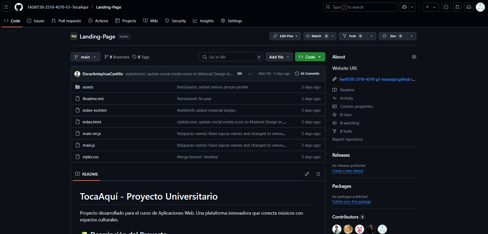
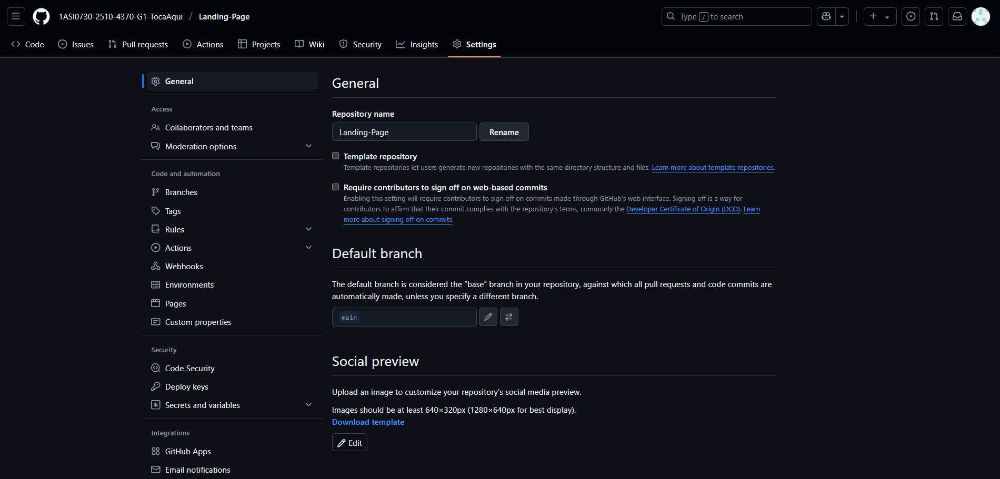
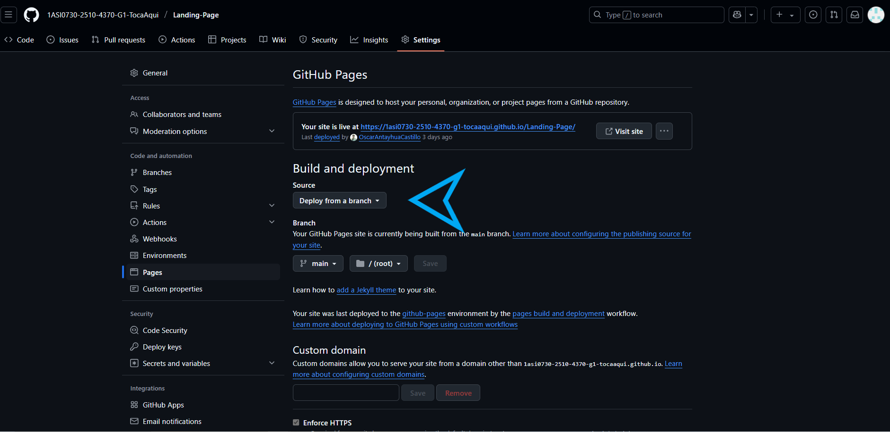

# Capítulo V: Product Implementation, Validation & Deployment

## 5.1. Software Configuration Management

### 5.1.1. Software Development Environment Configuration

#### Requirements Management

**Jira**: Herramienta de gestión ágil utilizada para organizar y monitorear las tareas del proyecto. Cada actividad fue registrada con una clave única y se asignó a miembros responsables, permitiendo controlar el avance por capítulo.  
Ruta de referencia: [https://www.atlassian.com/software/jira](https://www.atlassian.com/software/jira)

#### Product UX/UI Design

**Figma**: Plataforma online empleada para crear diseños visuales y prototipos navegables tanto para escritorio como dispositivos móvilxes. Fue esencial en la definición de la experiencia de usuario del landing.  
Ruta de referencia: [https://www.figma.com](https://www.figma.com)

#### Software Development

**Visual Studio Code**: Editor de texto utilizado por todos los miembros del equipo, elegido por su ligereza, compatibilidad con múltiples lenguajes y sus extensiones útiles para desarrollo web y control de versiones.  
Ruta de referencia: [https://code.visualstudio.com](https://code.visualstudio.com)

**HTML5 / CSS3 / JavaScript**: Tecnologías base para el desarrollo del sitio web estático. HTML estructura el contenido, CSS define el estilo visual y JavaScript brinda interactividad.

Referencias:
- HTML5: [https://www.w3schools.com/html/html5_syntax.asp](https://www.w3schools.com/html/html5_syntax.asp)
- CSS3: [https://google.github.io/styleguide/htmlcssguide.html](https://google.github.io/styleguide/htmlcssguide.html)
- JavaScript: [https://developer.mozilla.org/es/docs/Web/JavaScript](https://developer.mozilla.org/es/docs/Web/JavaScript)

**Git**: Sistema de control de versiones distribuido usado localmente para manejar el historial de cambios del proyecto.  
Ruta de referencia: [https://git-scm.com](https://git-scm.com)

#### Documentation & Project Hosting

**GitHub**: Plataforma en la nube donde se alojan los repositorios del equipo. Se utilizó para controlar versiones, gestionar ramas con GitFlow y mantener sincronizado el avance entre todos los integrantes.  
Repositorio de la Landing Page:  
[https://github.com/1ASI0730-2510-4370-G1-TocaAqui/Landing-Page](https://github.com/1ASI0730-2510-4370-G1-TocaAqui/Landing-Page)

#### Software Deployment

**GitHub Pages**: Servicio empleado para desplegar el sitio estático del proyecto directamente desde la rama `main`.  
Enlace en producción:  
[https://1asi0730-2510-4370-g1-tocaaqui.github.io/Landing-Page/](https://1asi0730-2510-4370-g1-tocaaqui.github.io/Landing-Page/)

**Vercel (previsto)**: Plataforma que será usada en los próximos sprints para desplegar la aplicación frontend en Vue.js, permitiendo despliegues automáticos desde GitHub.  
Ruta de referencia: [https://vercel.com](https://vercel.com)

### 5.1.2. Source Code Management

El equipo aplica la estrategia GitFlow, que organiza el desarrollo con ramas específicas para cada tipo de contribución. Las ramas implementadas en este Sprint fueron:

- `main`: contiene la versión estable desplegada
- `develop`: utilizada como base para integrar avances
- `feature/*`: se creó una rama por cada funcionalidad nueva del landing page

Durante este primer Sprint, se realizó trabajo activo en ramas `feature/*`, que luego fueron integradas mediante `merge` hacia la rama `main` para el despliegue en GitHub Pages. La estructura de ramas puede verse directamente en el historial del repositorio.

   

Repositorio principal:  
[https://github.com/1ASI0730-2510-4370-G1-TocaAqui/Landing-Page](https://github.com/1ASI0730-2510-4370-G1-TocaAqui/Landing-Page)

**Commits estructurados (Conventional Commits)**  
Se siguió el estándar [Conventional Commits](https://www.conventionalcommits.org) para mantener claridad y coherencia en el historial del proyecto. Ejemplos reales incluidos:

- `feat(html): added material design`
- `style(icons): replace RemixIcon with Material Design Icons library`
- `feat(a11y): add ARIA attributes to main navigation and header sections`
- `docs(readme): update documentation for UPC university project`

### 5.1.3. Source Code Style Guide & Conventions

#### HTML

- Todas las etiquetas deben cerrarse correctamente
- Comentarios cortos en línea
- Uso obligatorio de atributos `alt`, `width`, `height` en imágenes
- Nombres de clases en inglés, en lower-case con guiones

Referencia: [https://www.w3schools.com/html/html5_syntax.asp](https://www.w3schools.com/html/html5_syntax.asp)

#### CSS

- Indentación de 2 espacios
- Código en minúscula y limpio
- Comentarios explicativos por bloque
- Nombres de clase descriptivos y semánticos

Referencia: [https://google.github.io/styleguide/htmlcssguide.html](https://google.github.io/styleguide/htmlcssguide.html)

#### JavaScript

- Variables con nombres representativos
- Uso coherente de comillas (simples o dobles)
- Funciones modulares y reutilizables
- Comentarios en secciones complejas
- Evitar variables globales

Referencia: [https://developer.mozilla.org/es/docs/Web/JavaScript](https://developer.mozilla.org/es/docs/Web/JavaScript)

#### Vue.js (para sprints futuros)

- Carpetas organizadas por módulos: `components/`, `views/`, `store/`
- Reutilización de componentes
- Separación clara entre lógica y vista
- Documentación interna con props, eventos y métodos

Referencia: [https://vuejs.org/guide/introduction](https://vuejs.org/guide/introduction)

### 5.1.4. Software Deployment Configuration

Para desplegar la **Landing Page** del proyecto **TocaAquí** usando **GitHub Pages**, se siguieron los siguientes pasos:

1. **Ubicar el repositorio del proyecto**  
   Se accede al repositorio público alojado en GitHub que contiene el código fuente del sitio:  
   

2. **Ir a la sección de configuración (Settings)**  
   En la barra superior del repositorio, se hace clic en la pestaña **Settings**.

   

3. **Configurar GitHub Pages desde una rama**  
   En la sección **Pages**, dentro de **Build and deployment**, se selecciona `Deploy from a branch`.  
   Luego, se elige la rama `main` y la carpeta raíz `/ (root)` como origen del contenido.

   

Una vez configurado, GitHub genera automáticamente la URL pública del sitio, que queda disponible para validación, pruebas o entrevistas con usuarios.

**URL:** [`https://1asi0730-2510-4370-g1-tocaaqui.github.io/Landing-Page/index.html`](https://1asi0730-2510-4370-g1-tocaaqui.github.io/Landing-Page/index.html)

## 5.2. Landing Page, Services & Applications Implementation
### 5.2.1. Sprint 1
#### 5.2.1.1. Sprint Planning 1

| **Sprint #**                      | **Sprint 2**                                                                 |
|----------------------------------|------------------------------------------------------------------------------|
| **Sprint Planning Background**   |                                                                              |
| **Date**                         | 11/04/2025                                                                   |
| **Time**                         | 05:00 PM                                                                     |
| **Location**                     | Servidor de Discord del Equipo                                               |
| **Prepared By**                  | Oscar Antayhua                                                              |
| **Attendees (to planning meeting)** | Oscar Antayhua / Juan Llamccaya / Nelson Pereira / Diego Cabrera / Eddo Su Caletti |
| **Sprint 1 Review Summary**      |   Durante este sprint, el equipo trabajó en la base del proyecto: se desarrolló, diseñó y publicó la primera versión funcional de la landing page, incluyendo componentes clave como la descripción del servicio, los planes de suscripción, formularios de contacto y estructura multilenguaje. También se completaron actividades de UX como User Personas, Journey Maps y arquitectura de información.                                                                           |
| **Sprint 1 Retrospective Summary** |      Los integrantes coincidieron en que el trabajo en equipo fue eficiente y colaborativo. Se destacaron aciertos en la integración de herramientas como UXPressia, Figma y el diseño responsivo. Como mejora, se mencionó optimizar la gestión de tiempos entre subtareas y usar criterios de aceptación más claros desde el inicio.                                                                      |
| **Sprint Goal & User Stories**   |        Completar la fase de descubrimiento e investigación, validación de usuarios, análisis de la competencia, arquitectura de información y base de la landing.                                                                     |
| **Sprint 1 Goal**                |   Nuestro objetivo es desarrollar una landing page completa y coherente con el enfoque del proyecto “TocaAquí”, asegurando que fuera funcional, responsiva, accesible y atractiva para artistas y locales. Este sprint también sentó las bases para la experiencia del usuario mediante entregables como los User Personas, Empathy Maps, Wireframes y Style Guides.                                                                           |
| **Sprint 1 Velocity**            | 4 Velocity                                                                   |
| **Sum of Story Points**          | 6 Story Points                                                               |

#### 5.2.1.2. Aspect Leaders and Collaborators

| Team Member              | GitHub Username     | Landing Page | Diseño UI/UX | HTML/CSS | JavaScript | Documentación |
|--------------------------|---------------------|--------------|---------------|----------|-------------|----------------|
| Nelson Pereira           | fabrizzioper        | C            | C             | C        | L           | C              |
| Oscar Antayhua           | OscarAntayhuaCastillo | L            | C             | C        | C           | L              |
| Juan Llamccaya           | JuanPaulLla        | C            | C             | L        | C           | C              |
| Diego Cabrera            | omele7             | C            | C             | C        | L           | C              |
| Eddo Su Caletti          | Asalreon520        | C            | L             | C        | C           | C              |

#### 5.2.1.3. Sprint Backlog 1
#### 5.2.1.4. Development Evidence for Sprint Review

| Repository                                   | Branch | Commit Id | Commit Message                                           | Commit Message Body (resumen)                                                 | Committed on  |
|----------------------------------------------|--------|-----------|----------------------------------------------------------|--------------------------------------------------------------------------------|----------------|
| Landing-Page                                 | main   | 66dc745   | style(icons): update social media icons to Material Design in English version | Actualización de íconos en versión en inglés                                  | Apr 14, 2025   |
| Landing-Page                                 | main   | 7a73592   | Merge branch 'develop'                                  | Fusión de cambios desde rama develop                                           | Apr 14, 2025   |
| Landing-Page                                 | main   | 96d4570   | styles(webkit): fix errors on webkit background         | Correcciones visuales para navegadores WebKit                                 | Apr 14, 2025   |
| Landing-Page                                 | main   | e7d5c76   | feat(html): added material design.                      | Integración de Material Design a la estructura HTML                            | Apr 14, 2025   |
| Landing-Page                                 | main   | 041541c   | style(icons): replace RemixIcon with Material Design Icons library | Reemplazo de biblioteca de íconos por Material Design Icons                  | Apr 14, 2025   |
| Landing-Page                                 | main   | 4f76ad4   | feat(redes-sociales): added social icons                | Adición de íconos de redes sociales                                            | Apr 14, 2025   |
| Landing-Page                                 | main   | fe42468   | feat(a11y): add ARIA attributes to main navigation and header sections | Mejora de accesibilidad usando atributos ARIA                                | Apr 14, 2025   |
| Landing-Page                                 | main   | 3a2b1c0   | feat(assets): added nelson picture profile              | Imagen de perfil agregada a los assets                                         | Apr 14, 2025   |
| Landing-Page                                 | main   | f48a5df   | feat(html): added nelson profile picture url            | URL de imagen de perfil de Nelson en HTML                                      | Apr 14, 2025   |
| Landing-Page                                 | main   | 72f9f94   | fix(readme): fix year                                   | Corrección del año en README                                                  | Apr 14, 2025   |
| Landing-Page                                 | main   | 8102961   | docs(readme): update documentation for UPC university project | Actualización de README con detalles del proyecto universitario             | Apr 14, 2025   |
| Landing-Page                                 | main   | 8a13d40   | fix(styles): add standard background-clip property for cross-browser compatibility | Mejora de compatibilidad CSS                                                 | Apr 13, 2025   |
| Landing-Page                                 | main   | 3c01cbf   | fix(team): fix alt names.                               | Corrección de textos alternativos para accesibilidad                          | Apr 13, 2025   |
| Landing-Page                                 | main   | d2349fe   | style(responsive): enhance mobile layout and responsiveness | Mejora de estilos responsive                                                 | Apr 13, 2025   |
| Landing-Page                                 | main   | b84e7c7   | feat(hero): add segmentation buttons and improve responsive design | Botones segmentados para artistas y locales en la sección principal         | Apr 13, 2025   |
| Landing-Page                                 | main   | 9aeb89a   | fix(spaces-name): fixed spaces names and changed to venues and locales | Cambio de texto: "spaces" por "venues/locales"                              | Apr 13, 2025   |
| Landing-Page                                 | main   | 877734e   | feat(main.js): added event listener for plans           | JS para detectar selección de planes                                           | Apr 13, 2025   |
| Landing-Page                                 | main   | d7c58d5   | feat(assets): added some assets                         | Nuevos recursos gráficos                                                       | Apr 13, 2025   |
| Landing-Page                                 | main   | e9cf84f   | feat(styles): added some styles for different sections of html | Estilos adicionales para secciones varias                                  | Apr 13, 2025   |
| Landing-Page                                 | main   | 4041d0e   | feat(main-en): added javascript function for english landing page | Funcionalidad en JS para cambio de idioma                                    | Apr 13, 2025   |
| Landing-Page                                 | main   | b542750   | feat(landing-page): added plans and fix html structure  | Incorporación de planes y corrección de estructura                            | Apr 13, 2025   |
| Landing-Page                                 | main   | 257f243   | feat(index): Added english landing page                 | Se creó la versión en inglés de la landing                                     | Apr 13, 2025   |
| Landing-Page                                 | main   | 9eab618   | Merge branch 'feature/team' into develop                | Fusión de rama feature/team                                                   | Apr 12, 2025   |
| Landing-Page                                 | main   | a61b54a   | Merge branch 'feature/contact-us' into develop          | Fusión de rama feature/contact-us                                            | Apr 12, 2025   |
| Landing-Page                                 | main   | e34ae9a   | Merge branch 'feature/footer' into develop              | Fusión de rama feature/footer                                                | Apr 12, 2025   |
| Landing-Page                                 | main   | 5efaecc   | feat(styles): added some contact-us section styles      | Estilos para sección de contacto                                              | Apr 12, 2025   |
| Landing-Page                                 | main   | 1e1660d   | feat(contact-us): section contact-us added to html      | Maquetado HTML de la sección de contacto                                      | Apr 12, 2025   |
| Landing-Page                                 | main   | 40a6d3e   | fix(about-experience): fix duplicated content           | Corrección de contenido duplicado                                             | Apr 12, 2025   |
| Landing-Page                                 | main   | 9bfe3d2   | feat(team): update styles.css with responsive team section design | Diseño responsive de sección equipo                                        | Apr 11, 2025   |
| Landing-Page                                 | main   | 39e1e3e   | feat(team): add team section with basic structure and styles | Sección del equipo con estructura básica y estilos                         | Apr 11, 2025   |
| Landing-Page                                 | main   | 0a7f37f   | feat(about-experience): add experience section markup and styles | Sección de experiencia implementada                                        | Apr 11, 2025   |
| Landing-Page                                 | main   | 70e1ee6   | feat(contact): add styles for contact section            | Estilos CSS de la sección contacto                                            | Apr 11, 2025   |
| Landing-Page                                 | main   | 3d10749   | feat(footer): add footer section and structure          | Pie de página agregado                                                        | Apr 11, 2025   |
| Landing-Page                                 | main   | 58d02cc   | feat: added the experience section                      | Sección de experiencia general agregada                                       | Apr 11, 2025   |
| Landing-Page                                 | main   | 1c8b0e4   | feat: updated the landing page                          | Actualización general de la estructura de la landing                          | Apr 11, 2025   |
| Landing-Page                                 | main   | 62d0c5e   | feat(home): add hero section styles and animation       | Animación y estilos del home                                                  | Apr 08, 2025   |
| Landing-Page                                 | main   | 801c76e   | feat(about-us): add about section markup and styling    | Sección sobre nosotros                                                        | Apr 08, 2025   |
| Landing-Page                                 | main   | 9ff7dd7   | feat(assets): add about and home background             | Fondos de secciones                                                            | Apr 08, 2025   |
| Landing-Page                                 | main   | b74b1a2   | feat(assets): add light and dark versions of logo images | Versiones claras y oscuras del logo                                         | Apr 08, 2025   |
| Landing-Page                                 | main   | 3a20ccf   | feat(navbar): add responsive styles for navigation       | Estilos responsive para navbar                                                | Apr 08, 2025   |
| Landing-Page                                 | main   | 1c325e4   | feat(navbar): main js created                          | Funcionalidad JS para navegación                                              | Apr 08, 2025   |
| Landing-Page                                 | main   | 6f37fc7   | feat(navbar): index created                            | Archivo inicial index                                                         | Apr 08, 2025   |
| Landing-Page                                 | main   | 8e06aeb   | Create Readme.md                                        | README base creado                                                            | Apr 07, 2025   |

#### 5.2.1.5. Execution Evidence for Sprint Review
Para este primer Sprint, hemos desarrollado la Landing Page del proyecto "TocaAquí". A través de esta landing, los usuarios pueden visualizar de forma clara la propuesta de valor de nuestra plataforma, destinada a conectar músicos emergentes con locales de eventos, facilitando la contratación, coordinación y pagos seguros.

A continuación, se presentan las User Stories asociadas que se ejecutaron y evidencian el trabajo realizado:

| **ID** | **User Story** | **Evidencia en Landing Page** |
|:------:|:--------------:|:-----------------------------:|
| US01 | Acceso a la Landing Page desde distintos dispositivos | Visualización responsive en computadoras y móviles |
| US02 | Visualización de la información del propósito | Sección "Sobre Nosotros" describiendo la solución |
| US03 | Visualización de imágenes y gráficos relevantes | Imágenes en las secciones principales (home, about) |
| US04 | Tipografía cómoda y estéticamente agradable | Fuente limpia y moderna compatible con el estilo |
| US05 | Opción de navegación entre secciones | Menú de navegación y botones de acción funcionales |
| US06 | Formulario de contacto funcional | Sección de contacto con campos de entrada validados |

**Sección Sobre Nosotros**  
Muestra el propósito de TocaAquí, permitiendo al visitante entender rápidamente el objetivo de la plataforma.

**Nuestro Equipo**  
Se exhiben los perfiles de los desarrolladores de la startup, reforzando la transparencia y profesionalismo del proyecto.

**Planes Disponibles**  
Se muestra una estructura clara de planes para artistas y locales, acompañada de botones de acción intuitivos.

**Formulario de Contacto**  
Formularios para el envío de mensajes de contacto, cumpliendo criterios de accesibilidad y usabilidad.

#### 5.2.1.6. Services Documentation Evidence for Sprint Review

Durante el Sprint 1 no se trabajaron endpoints documentados, ya que el alcance se centró exclusivamente en el desarrollo del Landing Page. La documentación OpenAPI comenzará en el Sprint 2.

#### 5.2.1.7. Software Deployment Evidence for Sprint Review

Durante el Sprint 1, se realizó el despliegue de la landing page del proyecto utilizando **GitHub Pages**.

- **Repositorio:** [Landing-Page](https://github.com/1ASI0730-2510-4370-G1-TocaAqui/Landing-Page)
- **URL de producción:** [https://1asi0730-2510-4370-g1-tocaaqui.github.io/Landing-Page/](https://1asi0730-2510-4370-g1-tocaaqui.github.io/Landing-Page/)
- **Branch desplegado:** `main`

El sitio fue configurado y publicado correctamente, permitiendo acceso público a las secciones: Home, About Us, Team, Contact y Planes.

#### 5.2.1.8. Team Collaboration Insights during Sprint

Durante el desarrollo del Sprint 1, se evidenció una participación activa y distribuida entre los integrantes del equipo, reflejada tanto en la frecuencia de commits como en las funcionalidades aportadas. En total, se realizaron 39 commits, los cuales fueron generados por 5 autores diferentes, destacando la colaboración en ramas específicas como feature/about-us, feature/navbar y develop, todas correctamente integradas mediante pull requests.

| Integrante             | Commits | Líneas añadidas | Líneas eliminadas | Áreas de contribución principales                                                                 |
|------------------------|---------|------------------|--------------------|---------------------------------------------------------------------------------------------------|
| Oscar Antayhua Castillo | 32      | 2896             | 929                | Navegación, accesibilidad (ARIA), responsive, estilos, íconos, estructura HTML, despliegue GitHub Pages |
| JuanPaulLla            | 2       | 181              | 2                  | Sección de equipo (team), ajustes visuales                                                        |
| Asalreon520            | 2       | 132              | 0                  | Footer, sección de contacto                                                                       |
| omele7                 | 2       | 114              | 2                  | Sección de experiencia, mejoras generales en la landing                                           |
| fabrizzioper           | 1       | 112              | 0                  | Estructura y estilos de la sección experiencia                                                    |

Commits:

Analiticas de Colaboración:
